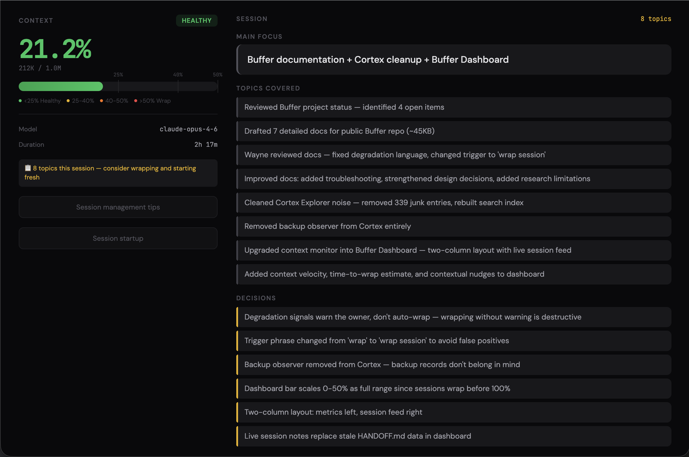

# Buffer

**Your agent forgets everything between sessions.** It doesn't know what happened yesterday, what was decided, or what to do next. The context window fills up, memory bloats, and skills stop firing.

Buffer fixes this.

- **Session continuity** — sessions seamlessly pick up where the last one left off
- **Reliable skill execution** — agents use skills instead of forgetting about them
- **Lower token costs** — fewer wasted tokens means lower API bills

## Install

```bash
clawhub install buffer
```

Or clone and copy:

```bash
git clone https://github.com/sigmalabs-ai/buffer.git
cp -r buffer/buffer ~/.openclaw/workspace/skills/
```

Ask your agent to run buffer. On first run, it sets up your workspace and starts managing sessions immediately. It also extracts a companion audit skill (`buffer-optimizer`) for periodic workspace health checks.

## What Buffer Does

Buffer recovers context on start, monitors the context window during work, writes structured handoffs at the end, and periodically audits your workspace for problems that silently degrade performance.

- Reads HANDOFF.md on start so the agent knows where it left off
- Tracks context window usage and wraps before quality drops
- Enforces skill checkpoints so installed skills actually get used
- Keeps boot files, memory, and config lean through periodic audits

## How It Works

One install, two skills:

**`buffer`** is the runtime — it manages your sessions. Instant context recovery, context monitoring with research-backed thresholds, and structured wraps that bridge to the next session. Lightweight — loads every session with minimal overhead.

**`buffer-optimizer`** is the auditor — extracted automatically on first run. Measures boot payload, checks AGENTS.md structure, classifies skills, validates memory files. Run it when things feel off or every week or two.

```
[First Run]
    ↓
buffer → Extract buffer-optimizer → Setup workspace → Report
    ↓
[Every Session After]
    ↓
buffer (Start) → Read HANDOFF → Read MEMORY → Orient
    ↓
buffer (Monitor) → Intake discipline, thresholds, degradation signals
    ↓
buffer (Wrap) → Extract outcomes → Write HANDOFF → Update MEMORY if needed
    ↓
[Session Ends]
    ↓
[Next Session] → buffer reads what the last session wrote
```

## Research

Buffer's thresholds and degradation model are informed by:

- [Context Rot — Chroma Research](https://research.trychroma.com/context-rot) (July 2025)
- [How Long Contexts Fail — Drew Breunig](https://www.dbreunig.com/2025/06/22/how-contexts-fail-and-how-to-fix-them.html) (June 2025)

## Requirements

- OpenClaw with workspace file support
- File system + shell access
- No external dependencies
- Works with any model and context window size

## Dashboard

Buffer includes a real-time dashboard that shows context window usage and live session activity.



**Left column** — context window percentage with color-coded zones, model info, and session management guides.

**Right column** — live feed of what's happening in the current session: main focus, topics covered, decisions made, and outcomes.

Install with one command:

```bash
bash <(curl -s https://raw.githubusercontent.com/sigmalabs-ai/buffer/main/dashboard/install.sh)
```

Or tell your agent: "Install the Buffer Dashboard." The installer downloads two files, sets up a background service (launchd on macOS, systemd on Linux), and starts the dashboard. No dependencies beyond Node.js.

The dashboard runs locally at `http://127.0.0.1:8111`. To access it from other devices, expose it via [Tailscale Serve](https://tailscale.com/kb/1242/tailscale-serve):

```bash
tailscale serve --bg 8112 http://127.0.0.1:8111
```

See [dashboard/README.md](dashboard/README.md) for the full user guide.

## Documentation

- **[Getting Started](docs/getting-started.md)** — Install, first run, what to expect
- **[How It Works](docs/how-it-works.md)** — The session lifecycle and five pillars
- **[Buffer Reference](docs/buffer-reference.md)** — Full reference for the buffer skill
- **[Optimizer Reference](docs/optimizer-reference.md)** — Full reference for buffer-optimizer
- **[Configuration](docs/configuration.md)** — Thresholds, file templates, AGENTS.md structure guide
- **[Design Decisions](docs/design-decisions.md)** — Why we made every major choice
- **[Research](docs/research.md)** — The science behind the thresholds

## License

Apache 2.0
